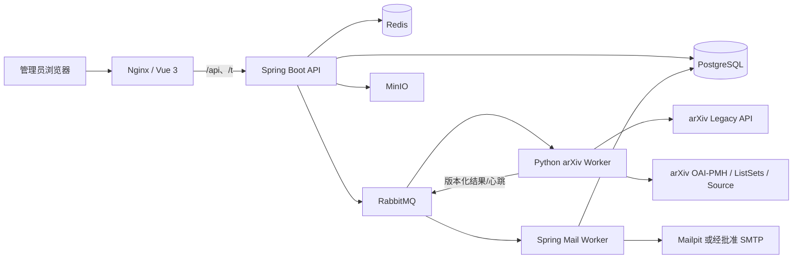

# 系统架构

## 目标与边界

平台把论文发现、Source 提取、联系人证据、邮件运营和分析拆成可审计的模块。HTTP API 不执行长时间下载或批量发送；任务进入 RabbitMQ，由隔离 worker 消费。PostgreSQL 是事实源，Redis 只承担短期协调与限速，MinIO 只保存上传图片和导出文件。

## 运行单元

| 服务 | 职责 | 持久状态 | 暴露 |
|---|---|---|---|
| `frontend` | Nginx 静态站点、API/Tracking 反向代理、安全头 | 无 | 生产唯一入口 8080 |
| `backend-api` | WebFlux API、授权、任务编排、Flyway | PostgreSQL | 仅内部 8080 |
| `mail-worker` | 邮件快照消费、频控、SMTP 发送与回写；`mail-worker` profile 不注册任何业务 API Controller | PostgreSQL/RabbitMQ | 仅内部 Actuator 健康端口 |
| `arxiv-worker` | Legacy/OAI 元数据、分类同步，以及 Source 安全下载/解包/TeX 提取 | Redis 租约/RabbitMQ；Source 仅在 tmpfs 短暂存在 | 不暴露端口 |
| `postgres` | 业务事实、审计、任务、分析聚合 | named volume | 内部 |
| `redis` | 限速、短期锁、缓存、SSE 协调 | named volume | 内部 |
| `rabbitmq` | 版本化异步消息、重试、死信 | named volume | 内部 |
| `minio` | 模板图片、导出、上传 | named volume | 控制台仅开发覆盖 |
| `mailpit` | 开发/测试 SMTP 捕获 | named volume | UI 仅开发覆盖 |

## 模块分层

- Identity：用户、角色、权限、Refresh Token、登录限制和审计。
- arXiv Catalog：分类快照、查询、论文、作者和版本。
- Extraction：Source 处理、提取运行、联系人映射、证据和置信度。
- Jobs：任务、任务项、事件、错误、worker 心跳和消息幂等。
- Messaging：模板、SMTP 账户、Segment、Campaign、Recipient、Delivery。
- Analytics：对有界论文队列执行只读聚合、数据集导出和新鲜度说明；Tracking 在后续阶段提供签名 Token、事件与活动聚合。

模块间通过应用服务和版本化消息交互，不允许跨模块绕过状态机直接修改核心状态。

## 数据流

1. API 创建任务与 `outbox_messages`，事务提交后发布 RabbitMQ。
2. Worker 按消息 `version`、`messageId`、`idempotencyKey` 验证并处理。
3. 结果回写前检查 `processed_messages`，重复消息只 ACK，不重复产生业务副作用。
4. `job_events` 驱动 SSE；客户端断线时使用任务详情轮询回退。
5. Phase 5 分析按页面顺序执行有界、索引支持的事务事实聚合，避免单请求并发占满连接池；不扫描原始追踪事件。活动数据量增长后再切换到带新鲜度状态的 V4 预聚合表/物化视图。

## Phase 3 arXiv 数据路径

交互式预览由 API 调用 Legacy API：条件先规范化并生成 SHA-256 哈希，相同请求读取 Redis 缓存；仅缓存未命中者取得全局租约后访问官方主机。批量导入、OAI `ListRecords` 和分类 `ListSets` 均形成 PostgreSQL Job + Outbox，再由 Python Worker 单连接消费。

Java 与 Python 使用同一 Redis server-time Lua 协议和租约键，所有实例的官方请求预约间隔不小于三秒。Redis 不可用时关闭外部请求，不降级为无限速访问。OAI resumption token 按不透明值原样续传，token 请求不混入 `set`、`from` 或 `metadataPrefix`；Worker 在 Redis 保存可恢复游标，API 同时把 progress checkpoint 投影到 PostgreSQL `arxiv_sync_cursors`。

Worker 先持久发布 started/progress/batch/terminal 结果，Spring 消费者在同一事务中写 `processed_messages`、论文/分类、任务计数和 `job_events`。分类内容只随成功 terminal 结果提交，快照激活和 Job `SUCCEEDED` 原子完成；ListSets 数据会与当前离线元数据合并以保留描述和 alias。消失分类只标记 inactive，既有论文关系不会被删除。重复消息 ACK 但不重复副作用，重复快照内容复用既有 snapshot。

## Phase 4 Source 数据路径

授权用户从论文库发起单篇或有界批量提取。API 在一个事务内创建 `ARXIV_FETCH_AND_PARSE_SOURCE` Job、任务项、CREATED 事件和 Outbox 命令，并拒绝同一论文/解析器版本的并发非终态任务。Worker 只根据已验证 arXiv ID 构造官方 `e-print` URL；逐跳白名单、共享限速、流式大小/MIME/magic 检查后，在 tmpfs 中执行有界归档读取和 TeX/include 解析，从不执行 Source 内容。

每篇结构化结果在后端信任边界再次校验。联系人以独立 AES-GCM nonce 加密，独立 HMAC 去重；论文作者、机构、映射、脱敏证据、提取运行、任务项和消息幂等标记原子写入。terminal 消息还要核对每个任务项已收到结果及计数总和，防止 poison result 进入 DLQ 后出现假成功。完整 Source 不进入 RabbitMQ、PostgreSQL 或 MinIO，Worker 只在临时目录删除后发布 `cleanupConfirmed=true`。

## Phase 5 分析数据路径

四类分析响应从同一个 `papers.imported_at` UTC 半开区间队列派生。最新 Source run 按论文去重，最新联系人映射先按论文/联系人去重再应用域名与置信度；作者按 canonical `authors.id` 跨论文去重。日期与任务状态序列补零，发现率类维度保留分子和分母。空队列返回 `freshness.status=NO_DATA` 和空 `dataThrough`，不会把筛选开始日伪装成数据时间。

每个页面的 SQL 依次订阅，限制单请求同时占用的 R2DBC 连接。`analytics:read` 允许聚合和不含完整邮箱的 CSV；用户目录筛选选项还需 `user:read`。CSV `dataset` 使用固定 allowlist，`all` 精确覆盖当前响应的窗口、新鲜度和所有图表数据，并在审计中记录数据集。V8 保持不可变；V9 以追加迁移修正两个索引顺序并设置 5 秒锁等待上限，生产升级必须使用运维文档中的停写维护窗口。

## 安全设计

- Nginx 设置 CSP、`nosniff`、拒绝 frame、权限策略和严格 Referrer Policy。
- 应用镜像多阶段构建，以专用非 root 用户运行并丢弃 Linux capabilities。
- 生产 Compose 只发布 Nginx；开发覆盖才发布 Mailpit/MinIO 控制台。
- 所有响应携带或生成 Trace ID；错误不暴露堆栈和 Secret。
- `ALLOW_LIVE_SMTP=false` 是默认值和 Compose 契约，后续真实发送还需要审批状态机。
- Source 出站 URL 固定为官方 HTTPS；归档路径、链接、文件数/尺寸/深度/压缩比和解析时间均有上限，且禁止运行 TeX 或 shell。
- 完整联系人只允许显式单条披露；列表/证据默认脱敏，披露和人工验证均审计。

## 前端设计基线

应用外壳适配自已授权的 Tailwind Plus `Sidebar with header`，业务内容采用 Bento Grid。DesignSkill 原始语义到 Vue 组件的映射见 `DESIGN_SKILL_COMPONENT_MAP.md`，视觉差异记录在 `design/DASHBOARD_FIDELITY_LEDGER.md`。
