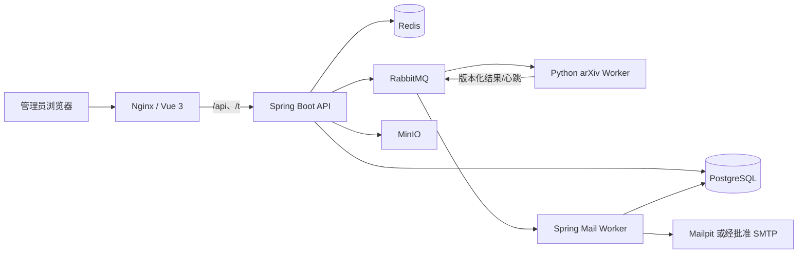

# 系统架构

## 目标与边界

平台把论文发现、Source 提取、联系人证据、邮件运营和分析拆成可审计的模块。HTTP API 不执行长时间下载或批量发送；任务进入 RabbitMQ，由隔离 worker 消费。PostgreSQL 是事实源，Redis 只承担短期协调与限速，MinIO 只保存上传图片和导出文件。

## 运行单元

| 服务 | 职责 | 持久状态 | 暴露 |
|---|---|---|---|
| `frontend` | Nginx 静态站点、API/Tracking 反向代理、安全头 | 无 | 生产唯一入口 8080 |
| `backend-api` | WebFlux API、授权、任务编排、Flyway | PostgreSQL | 仅内部 8080 |
| `mail-worker` | 邮件快照消费、频控、SMTP 发送与回写 | PostgreSQL/RabbitMQ | 仅内部健康端口 |
| `arxiv-worker` | arXiv/OAI 请求、Source 安全解包和证据提取 | 临时目录/RabbitMQ | 不暴露端口 |
| `postgres` | 业务事实、审计、任务、分析聚合 | named volume | 内部 |
| `redis` | 限速、短期锁、缓存、SSE 协调 | named volume | 内部 |
| `rabbitmq` | 版本化异步消息、重试、死信 | named volume | 内部 |
| `minio` | 模板图片、导出、上传 | named volume | 控制台仅开发覆盖 |
| `mailpit` | 开发/测试 SMTP 捕获 | named volume | UI 仅开发覆盖 |

## 模块分层

- Identity：用户、角色、权限、Refresh Token、登录限制和审计。
- arXiv Catalog：分类快照、查询、论文、作者和版本。
- Extraction：Source 处理、提取运行、联系人映射、证据和置信度。
- Jobs：任务、任务项、事件、错误、worker 心跳和消息幂等。
- Messaging：模板、SMTP 账户、Segment、Campaign、Recipient、Delivery。
- Tracking/Analytics：签名 Token、事件、聚合、保留策略。

模块间通过应用服务和版本化消息交互，不允许跨模块绕过状态机直接修改核心状态。

## 数据流

1. API 创建任务与 `outbox_messages`，事务提交后发布 RabbitMQ。
2. Worker 按消息 `version`、`messageId`、`idempotencyKey` 验证并处理。
3. 结果回写前检查 `processed_messages`，重复消息只 ACK，不重复产生业务副作用。
4. `job_events` 驱动 SSE；客户端断线时使用任务详情轮询回退。
5. 分析读取预聚合表/物化视图，不在请求路径扫描原始大表。

## 安全设计

- Nginx 设置 CSP、`nosniff`、拒绝 frame、权限策略和严格 Referrer Policy。
- 应用镜像多阶段构建，以专用非 root 用户运行并丢弃 Linux capabilities。
- 生产 Compose 只发布 Nginx；开发覆盖才发布 Mailpit/MinIO 控制台。
- 所有响应携带或生成 Trace ID；错误不暴露堆栈和 Secret。
- `ALLOW_LIVE_SMTP=false` 是默认值和 Compose 契约，后续真实发送还需要审批状态机。

## 前端设计基线

应用外壳适配自已授权的 Tailwind Plus `Sidebar with header`，业务内容采用 Bento Grid。DesignSkill 原始语义到 Vue 组件的映射见 `DESIGN_SKILL_COMPONENT_MAP.md`，视觉差异记录在 `design/DASHBOARD_FIDELITY_LEDGER.md`。
