# 数据模型与 ERD

Flyway 从空库按七个不可变迁移建立 53 张 public 表及 1 个物化视图。所有时间使用 UTC/timestamptz；业务主键使用 UUID，批处理明细使用适合顺序扫描的 bigint；软删除表以 `deleted_at` 过滤。

## 领域关系概览

```mermaid
erDiagram
    USERS }o--o{ ROLES : user_roles
    ROLES }o--o{ PERMISSIONS : role_permissions
    USERS ||--o{ REFRESH_TOKENS : owns
    USERS ||--o{ AUDIT_LOGS : acts

    ARXIV_GROUPS ||--o{ ARXIV_ARCHIVES : contains
    ARXIV_ARCHIVES ||--o{ ARXIV_CATEGORIES : contains
    ARXIV_CATEGORY_SNAPSHOTS ||--o{ ARXIV_CATEGORIES : versions
    PAPERS }o--o{ ARXIV_CATEGORIES : paper_categories
    PAPERS ||--o{ PAPER_VERSIONS : versions
    PAPERS }o--o{ AUTHORS : paper_authors
    PAPERS ||--o{ PAPER_IMPORTS : provenance
    PAPERS ||--o{ EXTRACTION_RUNS : extracted_by
    PAPER_AUTHORS ||--o{ PAPER_AUTHOR_CONTACTS : maps
    CONTACTS ||--o{ PAPER_AUTHOR_CONTACTS : evidence_for
    PAPER_AUTHOR_CONTACTS ||--o{ EXTRACTION_EVIDENCE : supports

    JOBS ||--o{ JOB_ITEMS : contains
    JOBS ||--o{ JOB_EVENTS : emits
    JOBS ||--o{ JOB_ERRORS : records
    JOBS ||--o{ PAPER_IMPORTS : imports
    JOBS ||--o{ JOBS : retry_lineage

    EMAIL_TEMPLATES ||--o{ EMAIL_TEMPLATE_VERSIONS : versions
    SEGMENTS ||--o{ SEGMENT_RULES : contains
    CAMPAIGNS ||--o{ CAMPAIGN_RECIPIENTS : snapshots
    CAMPAIGNS ||--o{ CAMPAIGN_LINKS : rewrites
    CAMPAIGN_RECIPIENTS ||--o{ DELIVERY_ATTEMPTS : attempts
    CAMPAIGN_RECIPIENTS ||--o{ TRACKING_TOKENS : signs
    CAMPAIGNS ||--o{ TRACKING_EVENTS : aggregates
```

## 迁移清单

| 迁移 | 范围 | 关键约束/索引 |
|---|---|---|
| `V1__identity_and_audit.sql` | Identity、RBAC、Refresh、登录、审计 | 用户名/邮箱大小写无关唯一；活跃 Token 到期索引；审计按时间/Actor/资源索引 |
| `V2__arxiv_papers_contacts_jobs.sql` | 分类、论文、作者、联系人、证据、任务 | arXiv ID 唯一；分类/时间/Source 状态索引；任务活跃心跳与明细状态索引；消息幂等 |
| `V3__templates_campaigns_tracking.sql` | SMTP、模板、Segment、Campaign、发送、追踪、抑制、Outbox | 活动状态/计划时间索引；Recipient 快照唯一；待发布 Outbox 部分索引 |
| `V4__analytics_and_retention.sql` | 日/小时聚合、刷新日志、保留策略、活动物化视图 | 维度唯一键；活动/链接时间索引；物化视图 Campaign 唯一索引 |
| `V5__rbac_defaults_and_auth_hardening.sql` | 26 项权限、5 个系统角色、认证加固 | 默认授权矩阵；token version/强制改密；refresh family 与登录审计索引 |
| `V6__arxiv_discovery_and_job_runtime.sql` | 分类快照、OAI 游标、保存查询哈希、Job runtime、论文导入来源/搜索 | 单 active snapshot；同步 token 一致性；Job lineage/重放索引；论文全文 GIN 与稳定筛选索引 |
| `V7__source_extraction_hardening.sql` | Source 运行幂等/尺寸/清理证明、联系人显示 nonce、映射乐观版本 | message 与 Job/Paper 唯一；清理时间一致性；联系人域/最新映射查询；映射版本非负 |

## 数据语义

- `papers` 保存规范化 arXiv 元数据；`paper_versions` 保留版本历史。
- `arxiv_category_snapshots` 保存离线/OAI `ListSets` 版本；同一时刻仅一条 active。分类从新快照消失时只把 `arxiv_categories.active` 置 false。
- `arxiv_sync_cursors` 持久化 API 已接收的 OAI set、from datestamp、opaque resumption token、响应时间和最后 Job；Worker Redis 游标负责暂停/重投恢复。token 与接收时间必须同时为空或同时存在，终态原子清空 active token。
- `saved_searches.criteria_hash` 是规范化条件的 SHA-256，用于所有者范围内缓存与幂等。
- `jobs.version` 支持乐观并发；`parent_job_id`/`root_job_id` 保留重试 lineage；Retry Job 与新 Outbox command 同事务创建。`checkpoint` 保存可观测进度，`job_events` 支持 SSE replay。
- `paper_imports` 记录论文与 Job 的来源（Legacy/OAI）和导入时间，同一论文/Job 只记录一次。
- `contacts` 是按独立 HMAC 去重的邮箱实体；规范化值与显示值分别用 AES-256-GCM 和不同随机 nonce 加密，只有 `email_domain` 等非敏感派生字段为明文。论文作者与联系人通过带乐观 `version` 的 `paper_author_contacts` 关联，证据只保存截断脱敏片段。
- `extraction_runs` 以消息 ID 和 Job/Paper 保证幂等，记录归档/展开尺寸、文件数、解析器版本和临时目录清理证明；Source 原始归档不长期保存。
- Source terminal 只有在 Job 的所有 `job_items` 已原子持久化结果且计数一致时才允许成功；失败消息不会留下半套联系人、提取运行或 `processed_messages`。
- `campaign_recipients` 是活动获批时的不可变收件人快照，不从实时 Contact 关系直接发送。
- `suppression_entries` 和 `unsubscribe_records` 在任何发送尝试前检查。
- `tracking_events` 保存受保留策略控制的原始事件；仪表盘使用聚合表。

## 迁移规则

1. 已发布迁移不可修改；新增变更创建下一版本。
2. 先写会失败的迁移测试，再从空 PostgreSQL 验证全部迁移。
3. 大表增加非空列时采用 nullable → 回填 → 约束的兼容步骤。
4. 索引必须对应查询/状态机路径，并检查写放大和基数。
