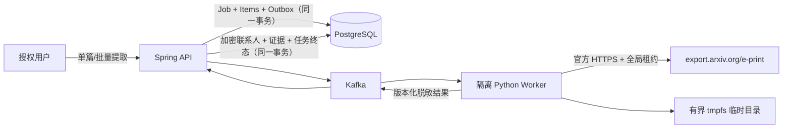

# TeX Source 提取

## 处理边界

Source 提取只接受数据库中已导入论文的 UUID。API 根据论文记录取得并重新校验 arXiv ID，Worker 自行构造 `https://export.arxiv.org/e-print/{arxivId}`；请求和消息都不能提供任意 URL。该流程只读取 Source 归档，不运行 TeX、BibTeX、Lua、shell escape、脚本、Makefile 或归档中的任何二进制文件。

## 下载与归档防护

- 现代和 legacy arXiv ID 都经过完整匹配；URL 只由固定官方基地址生成。
- 首次请求和每次重定向都要求 HTTPS 且主机在 `export.arxiv.org`、`oaipmh.arxiv.org`、`arxiv.org` 白名单内；最多 3 次重定向。
- Java API 与 Python Worker 共用 Redis server-time 租约，官方请求间隔不少于 3 秒。Redis 不可用时不访问上游。
- HTTP 响应按流读取，同时检查 `Content-Length`、实际字节数、允许的 MIME 和 magic bytes。404/410 归类为 `SOURCE_UNAVAILABLE`；429、5xx 和网络超时按有界退避重试；策略违规不重试。
- 只识别 tar、tar.gz、zip、单文件 gzip TeX 和纯 TeX。归档路径拒绝绝对路径、`..`、反斜杠、控制字符、过深目录、超长文件名、符号/硬链接、设备、FIFO 和其他非普通文件。
- 解包前和流式写入时同时限制总字节、单文件字节、文件数和压缩比；任何失败都会删除该任务目录。

Compose 默认限制：

| 配置 | 默认值 | 作用 |
|---|---:|---|
| `ARXIV_SOURCE_MAX_ARCHIVE_BYTES` | 52,428,800 | 下载归档最大字节数 |
| `ARXIV_SOURCE_MAX_EXTRACTED_BYTES` | 262,144,000 | 单篇展开后总字节数 |
| `ARXIV_SOURCE_MAX_SINGLE_FILE_BYTES` | 20,971,520 | 单个文件最大字节数 |
| `ARXIV_SOURCE_MAX_FILE_COUNT` | 5,000 | 单篇最多普通文件数 |
| `ARXIV_SOURCE_MAX_COMPRESSION_RATIO` | 100 | 最大展开/压缩比 |

Worker 还固定限制目录深度 20、include 深度 16、单篇解析时间 60 秒。Compose 把 `/var/tmp/arxiv-source` 挂为 512 MiB tmpfs；成功或失败都必须在结果中确认目录已清理，API 才保存 `cleanup_confirmed_at`。

## TeX 发现与解析

解析器按确定顺序寻找包含 `\documentclass`/`\begin{document}` 的根文件，再有界遍历 `\input` 和 `\include`。注释会被移除但保留转义百分号；缺失 include、循环、深度或文件上限不会导致路径逃逸。

作者区域支持常见 `author`/`authors`、`email`/`ead`、`thanks`、`affiliation`/`address`/`institute`、`corref`、authblk、revtex、IEEEtran、elsarticle 和简单自定义宏。解析只看标题、作者、前言和脚注等受控区域；正文和参考文献中的普通邮箱不会成为联系人。平台不按姓名或机构域名猜测地址，也不做网站爬取或 SMTP 探测。

联系人规则产生 `HIGH`、`MEDIUM`、`LOW` 或 `UNMAPPED`，并保留规则名、逻辑区域、安全相对路径、行号和截断后的脱敏上下文。机器提取默认 `UNVERIFIED`；低置信度、未映射、示例地址或未确认地址不能在后续活动中自动取得发送资格。

## 持久化、幂等与隐私

- Worker 命令和结果使用严格 v1 信封、消息 UUID、幂等键、字段/集合/长度上限和未知字段拒绝策略。消息不包含 Source 正文。
- 每篇结果的提取运行、作者、机构、联系人映射、证据、任务项、事件和 `processed_messages` 在一个 R2DBC 事务内提交；重复结果是无副作用 ACK。
- Job 只有在所有任务项都存在已持久化结果且成功/跳过/失败计数一致时才能进入终态，避免结果进入 DLQ 后任务被误标成功。
- 规范化邮箱和显示邮箱分别使用 AES-256-GCM、各自随机 nonce 加密；去重使用另一把独立密钥计算 HMAC-SHA-256。数据库明文只保留规范化域名和已经脱敏的短证据。
- 联系人列表始终脱敏。完整地址只在显式 `full=true`、具备 `contact:read_full` 时短暂解密，并记录 `CONTACT_EMAIL_DISCLOSED` 审计事件。
- Source 归档和展开文件不进入 PostgreSQL、Kafka、MinIO 或应用日志；任务结束后只保留尺寸、格式、文件数、解析器版本、清理证明和脱敏证据。

## 失败分类与排障

`SOURCE_UNAVAILABLE` 表示官方没有可下载 Source；`SECURITY_REJECTED` 表示下载、格式或归档违反安全边界；`FAILED` 表示不可恢复的解析/持久化错误。可恢复的上游错误按现有 Kafka 重试策略处理，超过上限进入 `camel.arxiv.dlt.v1`。

不要通过降低安全限制、改用第三方镜像、手工解压未知归档或在日志中打印消息全文来排障。应按 Job ID 检查任务事件、提取运行的非敏感指标、Worker heartbeat、队列和临时目录是否为空，操作步骤见 [运维手册](OPERATIONS.md)。
