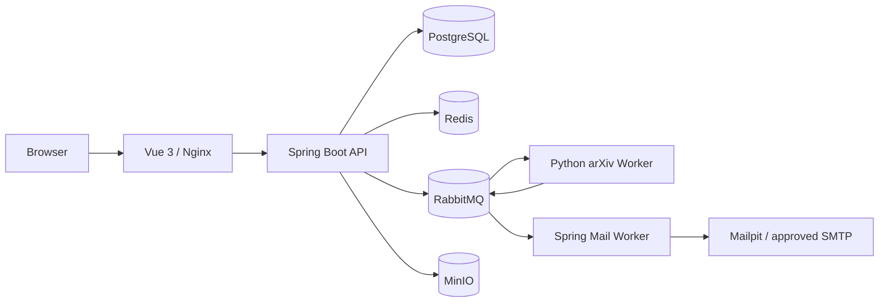

# arXiv 学术联络平台设计规格

**日期：** 2026-08-05  
**状态：** 已批准（用户已明确要求按原 Prompt 开发并自动批准后续设计请求）

## 1. 目标与边界

本项目交付一个单组织、细粒度 RBAC 的科研推广和合规学术联络平台。系统从 arXiv 官方接口同步分类和论文元数据，在隔离的 Python Worker 中下载并安全解析 TeX Source，只保留明确公开且有可审计证据的作者邮箱；邮件活动必须经过审批、抑制名单过滤、退订校验和多层限速后，才可由独立 Mail Worker 发送。

系统不猜测或枚举邮箱，不执行 TeX，不抓取非官方 arXiv 主机，不绕过 SMTP 或反垃圾邮件限制，不将 SMTP Accepted 描述为最终送达。开发和自动化测试只使用 Mailpit，`ALLOW_LIVE_SMTP` 默认关闭。

## 2. 方案比较与选择

### 方案 A：保留响应式骨架的模块化单体（采用）

Spring Boot API 和 Mail Worker 共享同一代码库与镜像，API 使用 WebFlux、R2DBC PostgreSQL、Redis、RabbitMQ 和 Flyway；Mail Worker 通过独立 Profile 消费发送任务。Python Worker 独立处理 arXiv 与 TeX。优点是最大程度沿用现有 WebFlux/R2DBC/Spring Modulith 选择，事务边界和部署单元较少，仍能把不可信 Source 与邮件发送隔离。代价是部分 JDBC/Flyway 和 SMTP 阻塞操作必须限定在线程池或独立进程中。

### 方案 B：改为 Spring MVC/JPA 模块化单体

JPA、Flyway、Spring Mail 和 Testcontainers 的生态更直接，但会替换现有响应式技术方向，不符合“优先沿用现有约定”，且会造成不必要的初始化级调整，因此不采用。

### 方案 C：拆分多个独立 Java 微服务

隔离最强，但认证、审计、数据库一致性、部署和消息契约的复杂度显著增加，首期没有多租户或独立扩缩容需求，不采用。

## 3. 总体架构

Spring Boot 按业务模块组织，而不是按 Controller/Service/Repository 横向堆叠。模块之间通过明确服务接口、数据库外键和版本化消息契约协作。初期保持单数据库，避免分布式事务；异步发布使用幂等键、唯一约束和可重试状态机。

## 4. 后端设计

- 保留 `com.camel_hub.advertisement` 根包和现有 Gradle Wrapper、启动类。
- 移除未使用的 MongoDB/MySQL/Gateway 依赖，改用 PostgreSQL R2DBC；Flyway 使用同一 PostgreSQL 的 JDBC 驱动执行迁移。
- 模块包括 `auth`、`user`、`role`、`permission`、`audit`、`arxiv`、`paper`、`author`、`contact`、`job`、`template`、`smtp`、`campaign`、`delivery`、`tracking`、`analytics`、`storage`、`internalworker`、`common`。
- Access Token 为短期 JWT；Refresh Token 仅以哈希形式入库，通过 HttpOnly/Secure/SameSite Cookie 轮换。登录失败限制同时使用数据库审计和 Redis 短期限流。
- 权限在方法层校验。查看完整邮箱、导出、SMTP 变更、活动审批和发送等敏感操作必须写审计日志。
- SMTP 密码和联系人邮箱用环境主密钥派生的 AES-GCM 密钥加密；邮箱 HMAC 用于去重，API 根据权限返回掩码或明文。
- REST API 使用 `/api/v1`、统一分页和 RFC 7807 风格错误；任务进度提供 SSE 与轮询回退。

## 5. 数据与迁移

Flyway 从空库创建用户/RBAC、论文/作者/联系人、任务、模板/SMTP、活动/投递/追踪、抑制/退订、聚合统计等表。所有业务实体使用 UUID，时间使用 UTC `timestamptz`。关键唯一约束覆盖 arXiv ID、邮箱 HMAC、消息幂等键、Campaign+Recipient 和 Tracking Token。

联系人只保存必要证据：相对源文件、解析规则、逻辑行号、截断且掩码的上下文。原始 TeX Source 不进入数据库或对象存储。统计使用索引、增量聚合表和按需刷新的物化视图，不为每张图扫描原始事件全表。

## 6. arXiv 与 Worker 数据流

1. API 对查询条件规范化并生成幂等键。
2. 少量预览使用 Legacy API；批量同步使用 OAI-PMH；分类优先官方 taxonomy/ListSets，失败时使用带版本的离线快照。
3. Redis 全局租约保证所有实例合计至少三秒一次官方请求，并对 429、5xx 和超时实施指数退避与抖动。
4. Python Worker 校验 arXiv ID 和官方主机白名单，限制重定向、响应体、MIME 和文件头。
5. 归档在临时目录中安全解包，拒绝绝对路径、路径穿越、链接逃逸、炸弹、超限文件和超深目录。
6. Worker 只解析文本，不执行或编译 TeX；递归发现 include 并应用深度/数量/时间限制。
7. 提取结果携带规则、置信度和脱敏证据，经版本化 RabbitMQ 消息返回；Spring 端按消息 ID 幂等落库。
8. `finally` 清理临时文件；任务支持暂停、恢复、取消和重试。

## 7. 邮件与追踪数据流

活动从草稿进入审核，批准后生成不可变收件人快照。快照创建时依次执行邮箱去重、置信度、人工确认、抑制、退订、格式、频率和域名限制。发送任务仅包含记录标识符，Mail Worker 在授权上下文中解密必要字段。

每次投递由唯一幂等键保护。SMTP `250` 记录为 `SMTP_ACCEPTED`；没有 DSN 或可靠 Webhook 时不计算最终送达率。打开 Token 和点击 Token 都是不可猜测且带签名的引用，Token 不含邮箱。点击目标只能来自预先验证并保存的 `http/https` URL，不接受查询参数覆盖。追踪事件保存 IP HMAC/摘要而非长期保存原始 IP，并区分原始事件、机器人/预加载和 Likely Human 指标。

## 8. 前端与 DesignSkill

前端采用 Vue 3、TypeScript strict、Vite、Tailwind CSS 4、Vue Router、Pinia、Axios、ECharts、Headless UI 和 Heroicons。Access Token 仅保存在内存 Store，Axios 使用单例刷新锁和请求取消。

应用外壳适配 DesignSkill `Application Shells / Sidebar Layouts / Sidebar with header`；首页适配 `Page Sections / Bento Grids / Two row bento grid with three column second row`。基础组件从 DesignSkill 的 Buttons、Input Groups、Select Menus、Checkboxes、Radio Groups、Toggles、Badges、Alerts、Modal Dialogs、Drawers、Dropdowns、Tabs、Tables、Pagination、Cards、Empty States、Notifications、Breadcrumbs、Page Headings、Stats 和 Form Layouts 适配。目录没有独立 Tooltip 模板，Tooltip 以其 Button、Popover/Dropdown 的色彩、间距、圆角和焦点规则组合实现，并在映射文档中明确标注。

当前 DesignSkill 目录对应 Vue/Tailwind 4.2，但上游可读源码为 React/Tailwind 4.3。适配时保留组件名称、来源 URL、主要 DOM 层级、Tailwind class、间距、圆角、阴影、颜色和交互语义；只转换框架状态、路由、真实数据与无障碍属性。许可证归属和适配清单记录在 `docs/DESIGN_SKILL_COMPONENT_MAP.md`。

## 9. 错误处理与安全边界

- 外部输入在 DTO、URL、模板变量、上传、消息和 Worker 边界分别校验。
- API 错误包含 Trace ID，不泄漏堆栈、密钥、JWT、完整邮箱、正文或 Source。
- HTML 模板采用白名单清理；变量按文本或 URL 上下文编码，未知变量阻止活动发送。
- SMTP TLS 证书验证不可在生产关闭；真实 SMTP 必须同时满足环境开关、管理员权限、账户测试和活动审批。
- Nginx 设置安全响应头、请求体限制和追踪端点缓存策略。
- 容器采用固定版本、多阶段构建、非 root 用户、最小权限、内部网络和健康检查。

## 10. 测试与验收

- Spring：JUnit、Spring Boot Test、WebTestClient、Testcontainers PostgreSQL/Redis/RabbitMQ/Mailpit；覆盖认证、RBAC、加密脱敏、状态机、幂等、抑制、退订、追踪签名、开放重定向和零分母。
- Python：pytest、Ruff、MyPy，使用安全归档和各类 TeX fixture，先验证失败再实现解析规则。
- Vue：Vitest、Vue Test Utils、TypeScript、ESLint；Playwright 覆盖登录、权限、分类、导入、解析、模板、审批、Mailpit、追踪和退订主流程。
- 每个阶段执行相应测试、lint、类型检查和 build；完成前再运行全量 Compose 健康检查和 E2E。

## 11. 分阶段交付

严格按照原 Prompt 的九个垂直切片推进：工程基础；认证/RBAC；arXiv 发现与导入；Source 解析；统计；模板/SMTP；活动发送；追踪；全量验证与发布。每个阶段必须形成可运行、可测试的增量并更新 `IMPLEMENTATION_PLAN.md` 与 `TASKS.md`。

已知环境风险：当前网络访问 Maven Central 返回 HTTP 403。实施时优先配置可审计的 Maven 镜像并保留 Maven Central；若镜像也不可用，将如实记录无法执行的 Java 验证，不把依赖解析失败描述为代码通过。
