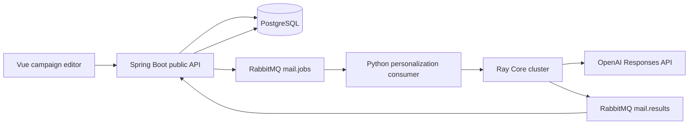

# Personalized Email Generation and Navigation Design

**Date:** 2026-08-10
**Status:** Approved for implementation

## Goal

Turn the unfinished email and analytics navigation into a working vertical slice that creates campaign recipients from trusted contacts, generates an individually reviewed draft from each author's paper content, and exposes truthful delivery and engagement reporting. Spring Boot remains the only public API. Python workers use Ray Core for distributed model calls. This slice stops before live campaign sending.

## Current Failure

The sidebar entries for segments, campaigns, deliveries, campaign analytics, link analytics, and settings point to hash fragments such as `#campaigns`. Vue Router treats them as same-page hash navigation, so the URL changes but the rendered view does not. The template list and template editor routes themselves are valid.

The database already contains the phase-seven and phase-eight tables, permissions already exist, and the existing template and SMTP modules provide the security policies needed by the new flow. There are no campaign application services, personalization contracts, result consumers, or real pages for the placeholder entries.

## Chosen Architecture

RabbitMQ is the durable boundary and Ray Core supplies parallel task execution. This keeps model latency outside request threads, avoids exposing a second public API, and lets failed author-level work retry independently. A Ray Serve HTTP endpoint is deliberately excluded because the original system boundary says Python workers are not public APIs.

OpenAI's Responses API is used with strict Structured Outputs. The requested response schema contains only `subject`, `html`, `text`, and `rationale`. The provider URL, model, timeout, and enabled state are configurable; the API key is read only from the worker environment and is never stored in PostgreSQL, sent through RabbitMQ, or returned to the browser. The default model is `gpt-5.6-luna`, overridable with `PERSONALIZATION_MODEL`.

## Privacy and Safety Boundary

The model input contains:

- author name;
- paper title, abstract, arXiv identifier, primary category, and public paper URL;
- public organization when available;
- the operator-written campaign purpose;
- the selected template body as a tone and structure reference.

The model input does not contain recipient email addresses, encrypted email fields, SMTP credentials, internal audit metadata, or suppression information. Email remains encrypted in the campaign recipient snapshot. The backend sanitizes and validates every result again with the existing template policy before storing it.

Every generated HTML and plain-text draft must include `{{unsubscribe_url}}`. Generated drafts are never sent automatically. Operators must inspect the per-recipient result, and later sending remains subject to the existing approval and SMTP safety controls.

## Public API and Pages

All sidebar entries become absolute registered routes:

| Page | Route | Permission | API |
| --- | --- | --- | --- |
| Recipient segments | `/email/segments` | `campaign:read` | `/api/v1/segments` |
| Campaigns | `/email/campaigns` | `campaign:read` | `/api/v1/campaigns` |
| Campaign detail/editor | `/email/campaigns/:id` | `campaign:read` | `/api/v1/campaigns/{id}` |
| Delivery records | `/email/deliveries` | `campaign:read` | `/api/v1/deliveries` |
| Campaign analytics | `/analytics/campaigns` | `analytics:read` | `/api/v1/campaign-analytics` |
| Link analytics | `/analytics/links` | `analytics:read` | `/api/v1/link-analytics` |
| System settings | `/admin/settings` | `system:manage` | `/api/v1/system/runtime` |

The settings response reports booleans and non-secret identifiers only: personalization enabled, provider name, selected model, RabbitMQ configured, Ray address configured, and live SMTP allowed. It never returns environment values that can contain credentials.

Empty delivery and analytics tables render explicit zero-data states. They do not invent sample metrics.

## Segment Rules

Segment expressions are intentionally constrained rather than accepting SQL or arbitrary expressions. The first supported rules are:

- `primaryCategory` equals one category;
- `confidence` in `HIGH` or `MEDIUM`;
- `verificationStatus` in an allowlist;
- `corresponding` equals true or false.

Rules are combined with `AND`. The preview endpoint returns counts and a small masked sample. Recipient materialization additionally excludes example domains, inactive contacts, suppressions, and unsubscribe records. Only contacts with `HIGH` or `MEDIUM` confidence are eligible.

## Campaign Workflow

1. The operator creates a segment and previews its eligible population.
2. The operator creates a draft campaign with a purpose, active template/version, segment, enabled SMTP account, sender identity, and mandatory unsubscribe behavior.
3. `POST /api/v1/campaigns/{id}/personalizations` materializes an immutable recipient snapshot and creates one generation job. The maximum batch size defaults to 100 and is configurable.
4. An outbox record and the publisher place one command on `mail.jobs` with routing key `mail.personalization.generate`.
5. The Python consumer validates the command and submits one Ray task per recipient. Ray retries transient model failures. The worker publishes a result per recipient to `mail.results` with routing key `mail.personalization.result`.
6. The backend result consumer validates identity and size, sanitizes the result, enforces the unsubscribe token, and updates the matching recipient idempotently.
7. The campaign detail page polls progress and shows generated, failed, queued, and running counts plus each recipient's draft and error state.

Repeated generation requests do not duplicate recipients. A new generation run is permitted only for a draft campaign and only failed or not-yet-generated recipients are requeued.

## Persistence Changes

A forward-only migration adds:

- campaign generation state, provider, model, job identifier, timestamps, and aggregate error summary;
- recipient personalization state, rationale, safe error code/message, attempt count, and completion timestamp;
- indexes for job/state polling.

Generation states are `NOT_REQUESTED`, `QUEUED`, `RUNNING`, `COMPLETED`, `PARTIALLY_FAILED`, and `FAILED`. Recipient personalization states are `PENDING`, `QUEUED`, `RUNNING`, `GENERATED`, and `FAILED`.

Existing delivery status remains separate from personalization status so the UI never labels generated text as sent or delivered.

## Message Contracts

Commands and results use versioned Pydantic/Java contracts with UUID identifiers and strict maximum lengths. Unknown fields are rejected. The command carries campaign and recipient identifiers, purpose, author/publication metadata, and style reference content; it never carries email or credentials.

Each result contains the command version, job, campaign and recipient identifiers, status, subject, HTML, plain text, rationale, provider/model metadata, and a safe error classification. Result processing uses the recipient and job identifiers as the idempotency key.

Transient failures include HTTP 429, timeouts, connection errors, and provider 5xx responses. They are retried with bounded exponential backoff and Ray task retries. Schema violations, authentication failures, and unsafe output fail permanently for that recipient. Partial failures remain visible and retryable.

## Ray Deployment

The worker image includes Ray 2.x. Compose adds three internal services:

- `ray-head`, started with `ray start --head --block` and no published dashboard port;
- `ray-worker`, joined to `ray-head:6379`;
- `personalization-worker`, consuming RabbitMQ and connecting to `ray://ray-head:10001` or the configured internal address.

All services use least-privilege container settings and internal networks. Only Ray task processes that call the provider receive the API key through their environment. The cluster has bounded CPU and memory reservations. A provider-disabled deployment remains healthy and reports generation as unavailable; it does not emit substitute content.

## Testing Strategy

Frontend tests first prove the current defect by asserting every visible sidebar target is an absolute, registered, non-hash route. View tests cover empty, loading, failure, create, preview, start generation, polling, and recipient draft states. Router permission tests cover the new routes.

Backend tests cover segment rule validation, suppression-safe recipient selection, campaign state transitions, message payload privacy, result sanitization, idempotency, authorization, and real aggregation queries. Database integration tests use the current PostgreSQL migration path.

Worker tests use an HTTP transport stub for Responses API schema and retry behavior. Ray execution is exercised in local mode with a deterministic generator stub, verifying fan-out, result identity, partial failure, and that commands contain no email field. Production code never falls back to the stub.

End-to-end verification starts the complete Compose stack, authenticates through the public frontend, visits every repaired sidebar route, creates a segment and draft campaign, verifies the provider-disabled state without a key, validates backend APIs directly, and checks the browser console. SMTP is limited to internal Mailpit and no live campaign send is triggered.

## Out of Scope

- public SMTP delivery or automatically sending generated drafts;
- public tracking endpoints and internet deployment;
- arbitrary segment expressions or model-authored recipient selection;
- storing or displaying provider secrets;
- claiming final email delivery from an SMTP acceptance event.

