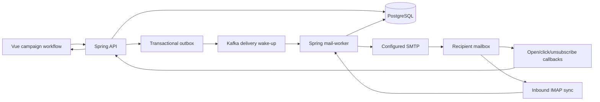

# Campaign Delivery and Feedback Loop Design

**Date:** 2026-09-03
**Status:** Approved in chat for a safety live run first; production recipient execution remains gated on a concrete sender identity and contact purpose.

## Goal

Complete the durable workflow from paper discovery through author extraction, personalized campaign drafting, controlled SMTP delivery, public engagement callbacks, unsubscribe handling, and inbound reply/bounce monitoring. Prove the workflow first with 20 personalized messages delivered only to the deployment-configured `zstbmw@163.com` safety inbox. A later production run may address real authors only after its sender identity, purpose, recipient evidence, preview, and explicit campaign approval all pass the same production gates.

## Verified Starting Point

The existing system already provides paper discovery/import, TeX source extraction, author/contact persistence, constrained segments, campaign recipient snapshots, Claude personalization through Kafka and Ray, SMTP/IMAP account administration, test-message SMTP transport, signed test-message open/click callbacks, and read-only campaign reporting pages.

The production gap is Phase 7 rather than an isolated defect:

- campaigns cannot move beyond draft personalization because review, approval, scheduling, start, pause, resume, cancel, and retry APIs do not exist;
- the `mail-worker` profile is an isolation shell and has no delivery consumer or scheduler;
- SMTP rate limits are stored but not enforced for campaigns;
- campaign delivery/tracking/suppression tables are not written by production code;
- IMAP supports connection tests and header previews only, with no reply/bounce reconciliation;
- campaign analytics currently reads fixture-compatible tables that never receive real campaign events.

The clean isolated baseline is 128 frontend tests, 231 Python worker tests, and a successful full Gradle test run.

## Selected Architecture

PostgreSQL remains the source of truth. The API writes campaign state and a small Kafka wake-up command in the same database transaction through the existing outbox. Kafka never carries an email address, SMTP credential, rendered body, callback token, or unsubscribe token. The Spring `mail-worker` consumes wake-ups and also performs bounded scheduled reconciliation so a lost or duplicated Kafka message cannot lose or duplicate a send.



Ray remains responsible for distributed model personalization. SMTP delivery is intentionally not a Ray task: rate reservation, suppression checks, delivery leases, and uncertain outcomes require short transactional coordination against PostgreSQL, while JavaMail already implements the hardened transport boundary.

## Two Strictly Separate Delivery Modes

### Safety live validation

Safety validation sends real SMTP messages but never contacts a logical campaign recipient. The destination comes only from the deployment variable `CAMPAIGN_SAFETY_RECIPIENT`; no API request may choose or override it. Production defaults to safety validation disabled. Enabling it requires all of:

- `CAMPAIGN_SAFETY_ENABLED=true`;
- `CAMPAIGN_SAFETY_RECIPIENT` containing a valid address;
- `ALLOW_LIVE_SMTP=true`;
- a currently enabled SMTP account with a successful connection test;
- an authenticated operator with `campaign:send`;
- a literal confirmation value `SAFETY_REDIRECT` in the start request.

The run selects at most 20 already generated recipient drafts. Each message has the safety inbox as both visible `To` and SMTP envelope recipient. The logical author email is never rendered into the message or exposed to the inbox; only its existing encrypted snapshot, HMAC, and masked administrative identity remain in PostgreSQL. The body carries a prominent safety-validation banner and preserves the author's name, paper, personalized content, public paper link, and tracking behavior.

Safety validation uses dedicated `campaign_safety_runs`, `campaign_safety_messages`, `campaign_safety_links`, and `campaign_safety_events` records. Its accepts, opens, clicks, unsubscribe simulations, replies, and bounces never update `campaign_recipients`, `delivery_attempts`, `tracking_events`, `unsubscribe_records`, `suppression_entries`, production campaign metrics, or contact status. This guarantees that testing cannot create a false author-contact history.

The configured SMTP account limits still apply. With the current 163 policy of 2 messages per minute, 10 per hour, 30 per day, and 10 per recipient-domain hour, 20 safety messages require at least two hourly windows. The UI reports an estimate and progress; it must not raise limits or burst around the provider policy.

### Production author delivery

Production delivery uses only the immutable campaign recipient, template-version, SMTP-account, sender, reply-to, and rendered-content snapshots that passed review. It never reruns a segment or silently substitutes a recipient after approval. A production send is blocked until the campaign has a concrete, truthful sender identity and contact purpose. The current user-provided text leaves those values unsupplied, so implementation and safety validation may complete while external SMTP remains blocked.

## Campaign State Machine

The API enforces these transitions with optimistic `lockVersion` checks:

```text
DRAFT -> READY_FOR_REVIEW
READY_FOR_REVIEW -> APPROVED | REJECTED
REJECTED -> DRAFT
APPROVED -> SCHEDULED | RUNNING
SCHEDULED -> RUNNING | CANCELED
RUNNING <-> PAUSED
RUNNING | PAUSED -> CANCELED
RUNNING -> COMPLETED
```

`PUT /campaigns/{id}` may change draft metadata only while the campaign is `DRAFT` or `REJECTED`; a rejected edit returns it to `DRAFT` and clears obsolete approval fields. Approval is a separate audited action. The same administrator may create and approve in this single-administrator deployment, but the action, actor, time, preflight digest, and before/after state are persisted.

Completion means every production recipient is in a terminal state. SMTP acceptance is displayed as “SMTP 已接受”, never “已送达”. Pause and cancel affect only work not yet handed to SMTP.

## Preflight and Recipient Eligibility

`GET /api/v1/campaigns/{id}/preflight` is side-effect free and returns named checks, exclusion counts, rate-limit estimates, and the final production-eligible count. `submit-review`, `approve`, `schedule`, and `start` recompute the relevant checks server-side and never trust a previous UI result.

A production recipient is eligible only when all conditions are true at send time:

- the campaign snapshot has a generated subject, sanitized HTML, and non-empty plain text;
- the draft retains `{{unsubscribe_url}}` until final send-time rendering;
- contact status is `ACTIVE`, confidence is `HIGH`, and an author relation exists;
- the evidence decision is `CONFIRMED` and `human_verified=true`;
- the address is not an example/test domain and syntax remains valid;
- no global suppression, unsubscribe record, or campaign exclusion exists;
- no SMTP acceptance for the same email HMAC occurred within the configured 180-day production cooldown;
- SMTP, public callback, mailbox mapping, template, sender, and reply-to checks pass.

Safety validation may use generated drafts whose logical contacts have not yet completed production evidence review because it does not address them. The UI labels those rows as validation inputs, not approved recipients.

## Durable Claiming, Limits, and Idempotency

The mail worker claims one due item in a short transaction using `FOR UPDATE SKIP LOCKED`. The same transaction:

1. verifies campaign/run state and rechecks suppression or safety scope;
2. locks the SMTP account row;
3. reserves minute, hour, day, and recipient-domain-hour capacity across both production and safety attempts;
4. locks or creates the cross-campaign cooldown row for production mode;
5. creates a `CONNECTING` attempt with a stable idempotency key and RFC Message-ID;
6. stores a random delivery lease hash and expiry;
7. commits before any network I/O.

SMTP completion updates require the matching lease. A second worker cannot claim the same item. The stable idempotency key is `delivery:<campaign-recipient-id>:<attempt-number>` for production and `safety:<safety-message-id>:<attempt-number>` for validation. Kafka duplication only wakes the database pump again and cannot create another accepted attempt.

Rate enforcement uses the SMTP account row as the serialization lock and counts active reservations/attempts over rolling one-minute, one-hour, one-day, and per-domain one-hour windows. This avoids a separate eventually consistent counter. A denied reservation sets `nextAttemptAt` to the earliest known window boundary without creating a network attempt.

## SMTP Outcome Semantics

The transport returns a structured outcome with stage, response code when available, safe response summary, and category:

- explicit 2xx completion: `SMTP_ACCEPTED`;
- explicit retryable 4xx before an accepted DATA result: `TEMPORARY_FAILURE` with bounded exponential retry;
- explicit 5xx, invalid address, authentication, TLS, or configuration rejection: `PERMANENT_FAILURE`;
- timeout, disconnect, or unexpected error after DATA may have been accepted: `OUTCOME_UNKNOWN`.

`OUTCOME_UNKNOWN` is terminal for automation. It requires an administrator decision and is never automatically retried because a retry could duplicate mail. Expired leases are reconciled to `OUTCOME_UNKNOWN`, not reclaimed. At most three attempts are permitted for provably temporary failures, with delays of 1 minute and 5 minutes before the final attempt.

The SMTP MIME message has a stable RFC Message-ID and correlation header. HTML and plain text are multipart alternatives. Production messages also carry RFC 8058-compatible `List-Unsubscribe` and `List-Unsubscribe-Post` headers. Header values are generated only from server-side signed callback URLs.

## Production Open, Click, and Unsubscribe Tracking

Campaign tracking uses the existing `campaign_links`, `tracking_tokens`, and `tracking_events` tables. A campaign-specific signer uses independent domain-separated HMAC formats for open, click, and unsubscribe tokens. Token payloads contain only canonical UUIDs, expiry, a nonce, and a signature; PostgreSQL stores only token digests.

At send time:

- `{{unsubscribe_url}}` is replaced in both HTML and plain text with the signed recipient-specific URL;
- eligible absolute HTTP(S) links are validated, persisted server-side, and replaced with signed click callbacks;
- the open pixel is appended only when open tracking is enabled;
- unsubscribe links are never rewritten as ordinary click links;
- the final rendered subject, HTML, and plain text remain in the existing recipient snapshot for audit.

Existing `/t/o/{token}` and `/t/c/{token}` controllers route domain-separated test-mail and campaign tokens without revealing which namespace failed. Invalid callbacks remain generic and privacy-preserving. Campaign callbacks insert deduplicated events and update first-open/first-click timestamps. Classifications distinguish unclassified, likely human, bot, prefetch, and security scanner; UI copy calls opens and clicks estimates and never claims proof of reading.

`GET /u/{token}` renders a confirmation page. `POST /u/{token}` and RFC 8058 one-click requests atomically create or reuse an unsubscribe record, add a global suppression entry, mark unsent matching production work `UNSUBSCRIBED`, and return a generic success result. Safety tokens record only a safety event and never suppress any logical address.

## Inbound IMAP Reply and Bounce Monitoring

Campaigns select an enabled IMAP mailbox account used for reply/bounce monitoring. The mail worker polls with a database-backed UIDVALIDITY/UID cursor and a lease so multiple workers cannot process the same mailbox concurrently. It fetches bounded headers and only the MIME structure needed for standards-based classification; it never stores full bodies or attachments and never marks, moves, or deletes remote messages.

An inbound message is associated only by a stable outbound RFC Message-ID found in `In-Reply-To`, `References`, a standards-structured DSN original-message field, or an attached original-message header block. Sender address or subject alone never establishes a match.

The worker records one idempotent event per `(mailboxAccountId, folder, uidValidity, uid)`, classified as `REPLY`, `AUTO_REPLY`, `BOUNCE`, or `UNMATCHED`. A verified permanent DSN changes a production recipient to `BOUNCED` and adds a suppression entry. A matched reply updates a separate `repliedAt` field but does not imply an open or delivery. Safety inbound events remain within the safety run. Unmatched and malformed items remain observable without changing campaign/contact state.

## Database Changes

A forward-only V16 migration adds:

- campaign `lock_version`, state-change metadata, selected mailbox, and review-preflight digest;
- recipient delivery lease, attempt, retry, RFC Message-ID, reply, and unknown-outcome fields plus expanded constraints/indexes;
- attempt stage/outcome metadata needed for safe retry classification;
- `recipient_delivery_cooldowns` for production cross-campaign acceptance cooldown;
- `campaign_safety_runs`, `campaign_safety_messages`, `campaign_safety_links`, and `campaign_safety_events`;
- campaign unsubscribe token support;
- `mailbox_sync_cursors` and `mailbox_inbound_events` with idempotency constraints;
- indexes for due work, campaign progress, callback resolution, and mailbox UID lookup.

The migration is additive and forward-only. Existing diagnostic/template tracking rows and callback tokens remain valid. Existing draft campaigns with no mailbox mapping remain readable and fail preflight with an actionable message.

## Kafka Contract and Worker Profiles

The new topic is `camel.mail.delivery.jobs.v1`, with three local partitions and seven-day retention. A wake-up payload is versioned and contains only message ID, campaign or safety-run ID, action, trace ID, and creation time. The API outbox publisher allowlist is extended for this topic.

The `mail-worker` profile receives only the repositories, crypto/policy/SMTP transport, campaign tracking, delivery scheduler/listener, and inbound mailbox synchronization beans it needs. It exposes no identity, campaign-management, contact, job, or administrator controllers. Its readiness includes database and Kafka connectivity; SMTP/IMAP provider availability is surfaced as runtime state but does not make the process unhealthy.

## Public API

The campaign API gains:

```text
PUT  /api/v1/campaigns/{id}
GET  /api/v1/campaigns/{id}/preflight
POST /api/v1/campaigns/{id}/submit-review
POST /api/v1/campaigns/{id}/approve
POST /api/v1/campaigns/{id}/reject
POST /api/v1/campaigns/{id}/schedule
POST /api/v1/campaigns/{id}/start
POST /api/v1/campaigns/{id}/pause
POST /api/v1/campaigns/{id}/resume
POST /api/v1/campaigns/{id}/cancel
POST /api/v1/campaigns/{id}/safety-runs
GET  /api/v1/campaigns/{id}/safety-runs
GET  /api/v1/campaigns/{id}/safety-runs/{runId}
GET  /api/v1/campaigns/{id}/engagement
```

State-changing requests require `expectedLockVersion`. Safety start additionally requires `recipientLimit` between 1 and the configured maximum of 20 and the literal confirmation. Existing permissions map as follows: create/edit/submit uses `campaign:create`; approve/reject uses `campaign:approve`; safety/start/schedule uses `campaign:send`; pause/resume/cancel uses `campaign:pause`; all reads use `campaign:read` or `analytics:read` as appropriate.

Public callbacks remain unauthenticated but opaque, rate-limited, non-enumerable, and covered by the existing Nginx `/t/` privacy boundary. `/u/` receives equivalent no-log, rate-limit, no-referrer, and no-store handling.

## Frontend Workflow

The existing route and design-system structure stays intact. `CampaignDetailView` becomes the operational center rather than creating another navigation hierarchy. It shows:

- a compact lifecycle stepper and truthful state badge;
- preflight checks and exact exclusion counts;
- personalization progress kept separate from delivery progress;
- a safety-validation card with fixed masked destination, 1–20 limit, explicit confirmation modal, elapsed/rate-window estimate, and per-message results;
- permission-aware review, approve/reject, start/schedule, pause/resume/cancel controls;
- recipient rows with logical eligibility, SMTP state, opens/clicks, unsubscribe, bounce, and reply evidence;
- worker heartbeat/staleness and the distinction between SMTP acceptance and final delivery.

`DeliveriesView` retains separate “test message”, “safety validation”, and “production campaign” tabs. Campaign analytics adds SMTP accepts, temporary/permanent/unknown outcomes, bounces, unsubscribes, replies, likely-human and automated engagement. Tokens, raw email addresses, full inbound content, and secrets never enter frontend responses.

## Error Handling and Audit

Every campaign mutation, safety run start, review decision, production start, pause/resume/cancel, manual unknown-outcome decision, unsubscribe, permanent bounce suppression, and mailbox synchronization failure has a structured audit event. Logs carry trace ID, campaign ID, run ID, recipient/message ID, attempt ID, topic/partition/offset where applicable, and safe categories; they never contain message bodies, raw recipient addresses, passwords, tokens, or provider API keys.

An unavailable Kafka broker leaves the outbox pending. An unavailable SMTP or IMAP provider produces categorized attempt/sync state and retry timing without blocking unrelated services. A callback database write failure still returns the safe pixel or a previously resolved redirect but does not invent an event. Scheduling reconciliation completes campaigns only from database terminal states.

## Testing Strategy

Every behavior change follows red-green-refactor. Backend tests cover state transitions, RBAC, optimistic conflicts, preflight literals, strict evidence eligibility, send-time suppression races, immutable snapshots, outbox privacy, duplicate Kafka wake-ups, concurrent claims, all four rate windows, cross-campaign cooldown, SMTP outcome classification, bounded retry, unknown outcomes, expired leases, safe/production isolation, open/click signing, open-redirect rejection, unsubscribe idempotency, safety no-op unsubscribe, IMAP cursor idempotency, reply correlation, structured DSN bounce handling, unmatched inbound mail, and reporting denominators.

Frontend tests cover preflight states, lifecycle controls, permissions, confirmation modal, safety destination/limit copy, progress polling, three delivery tabs, engagement labels, empty/error/loading states, and the prohibition on human-read/delivered claims. Existing 128 frontend tests, 231 worker tests, and the full backend suite remain green. Lint, typecheck, backend build, frontend production build, Python Ruff/Mypy, Compose validation, migration tests, container-image verification, and browser console checks are mandatory.

No automated test sends to a public address. Unit/integration tests use Mailpit/GreenMail. The separately authorized production acceptance run is performed only after code verification and deployment.

## Deployment and Live Acceptance

Deployment creates and checksums a PostgreSQL backup, records the running image versions, validates the new migration against a copy, and changes only the project services and the existing `arxiv.nodexi.top` vhost locations needed for `/u/`. It builds immutable images from the reviewed commit, updates the backend API, mail worker, and frontend, waits for health, verifies Kafka topics and consumer lag, and exercises authenticated APIs before any SMTP side effect.

The authorized safety acceptance run then:

1. discovers and imports a small relevant paper set;
2. extracts author/contact evidence and waits for terminal job states;
3. materializes 20 distinct personalized drafts through Claude and Ray;
4. starts one 20-message safety run to the fixed 163 inbox;
5. waits through provider rate windows until all rows are terminal;
6. verifies 20 inbox messages by bounded IMAP metadata without exposing bodies;
7. exercises one signed open, click, and safety-unsubscribe callback through public HTTPS;
8. verifies callback classification, no production metric/suppression pollution, Kafka lag, worker health, and UI state in Edge;
9. observes inbound synchronization and records whether a genuine reply or DSN exists without manufacturing either claim.

The run is successful only if all 20 messages have durable terminal states, every SMTP acceptance is described truthfully, no external logical recipient was contacted, callback URLs resolve through HTTPS, safety events stay isolated, and production recipient/contact state remains unchanged.

After safety acceptance, the system may prepare a production campaign and recipient review queue. It must stop before external delivery until a concrete sender identity and contact purpose replace the currently unsupplied values and the final 20-recipient/content preview receives the production campaign approval action.

## Explicit Non-Goals

- bypassing 163 or domain rate limits;
- treating SMTP acceptance as final delivery;
- treating an image proxy, scanner click, IMAP Seen flag, or self-addressed safety message as human engagement;
- automatically approving evidence or inventing a sender identity/contact purpose;
- auto-retrying an uncertain SMTP outcome;
- storing inbound bodies, attachments, raw IP addresses, plaintext credentials, or raw logical email addresses in safety records;
- changing unrelated Nginx virtual hosts, server firewall policy, or project services.
